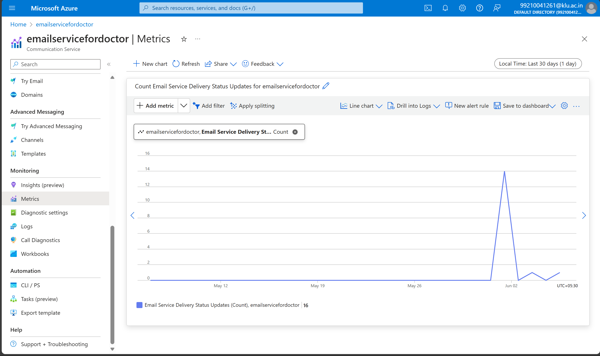
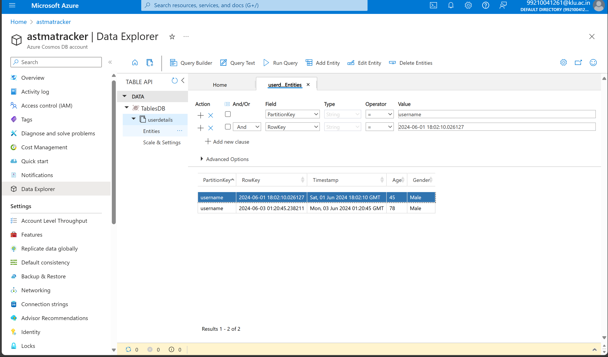
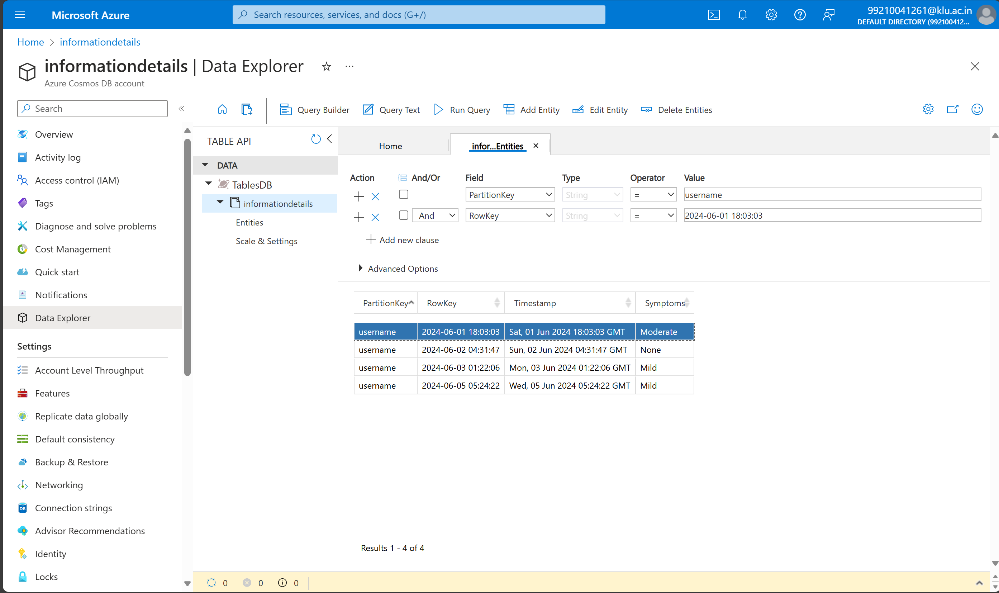

# Asthma Symptoms Checker: A Machine Learning and Cloud-Based Alert System for Patient Monitoring

## Overview

The "Asthma Symptoms Checker" project aims to provide an innovative solution for asthma patients to monitor their symptoms and communicate effectively with healthcare providers. By leveraging technology, it creates a user-friendly platform that assesses asthma symptoms, predicts their severity using a machine learning model, and sends real-time alerts to healthcare providers. This ensures timely intervention and better management of the condition.

## Features

- **Symptom Input Interface:** Users can select their symptoms through a simple, intuitive interface.
- **Machine Learning Model:** Analyzes symptoms and predicts the severity of asthma (Mild, Moderate, or None) using Azure Machine Learning.
- **Automated Email Alerts:** Sends detailed email alerts to healthcare providers upon prediction.
- **User Data Storage and Retrieval:** Securely stores and retrieves user data using Azure Cosmos DB to personalize the experience and improve prediction accuracy.

## Purpose and Benefits

The "Asthma Symptoms Checker" addresses the need for better symptom monitoring and communication in asthma management. By providing real-time, automated, and accurate symptom checking, it ensures timely interventions and reduces the risk of severe episodes. This project empowers asthma patients with a reliable tool for symptom assessment and facilitates seamless communication with healthcare providers.

## Technologies Used

- **Azure Communication Services:** For sending email alerts to healthcare providers.
- **Azure Machine Learning:** For training and deploying the machine learning model to predict asthma symptom severity.
- **Azure Cosmos DB:** For storing and retrieving user data securely.
- **Streamlit:** Framework for building the interactive web application.

## Implementation Details

## Azure Communication Service (Email) Implementation

I implemented Azure Communication Service (Email) in my project to send email alerts to doctors with patient information and predicted severity of asthma symptoms. Here's how I used it:

1. Imported the necessary library: `azure.communication.email`
2. Set up an `EmailClient` instance using the connection string.
3. Defined a function, `emailalert`, to send emails using the `EmailClient` instance.
4. Passed patient information and predicted severity as parameters to the `emailalert` function.
5. Used the `emailalert` function to send emails to doctors with patient information and predicted severity.

By implementing Azure Communication Service (Email) in this way, I was able to leverage its secure and scalable email capabilities to send patient information and predicted severity to doctors, enabling timely interventions and better patient care.

Here's the code snippet for the `emailalert` function:

```python
def emailalert(username, age, gender, response, Tiredness, Dry_Cough, Difficulty_in_Breathing, Sore_Throat, Pains, Runny_Nose, Nasal_Congestion):
    try:
        connection_string = "endpoint=https://emailservicefordoctor.unitedstates.communication.azure.com/;accesskey=MoSnxVTrnctDeX+TlYzktQelasXZxPQMkSSLyIavDRv90bd6xaSwYvhyKmAaFhpcTEuYUj9TNknrHVWcyFp2ow=="
        client = EmailClient.from_connection_string(connection_string)

        message = {
            "senderAddress": "DoNotReply@4df436e1-3dcd-4506-aef3-235582550c8a.azurecomm.net",
            "recipients":  {
                "to": [{"address": "99210041261@klu.ac.in" }],
            },
            "content": {
                "subject": f"Asthma Symptoms Alert of patient {username}",
                "plainText": f"""Patient : {username}\nAge: {age}\nGender: {'Male' if gender == 1 else 'Female'}\nSymptoms : Tiredness: {Tiredness}, Dry Cough: {Dry_Cough}, Difficulty in Breathing: {Difficulty_in_Breathing}, Sore Throat: {Sore_Throat}, Pains: {Pains}, Runny Nose: {Runny_Nose}, Nasal Congestion: {Nasal_Congestion}\nPredicted Severity: {response}\nPlease review the patient's condition and provide further instructions.""",
            }
        }

        poller = client.begin_send(message)
        result = poller.result()

    except Exception as ex:
        st.error(f"An error occurred while sending the email: {ex}"
```

## Azure Communication Metrics


## Azure Cosmos DB Implementation

In this project, I utilized Azure Cosmos DB as the database service to store and retrieve user data. This allowed me to:

- Store user information, including username, age, and gender
- Retrieve user data to personalize the user experience and improve prediction accuracy
- Take advantage of robust security features, such as encryption at rest and in transit, to ensure sensitive user data was protected
- Scale my database to handle a large volume of user data without worrying about infrastructure
- Utilize the Cosmos DB SDK to interact with the database

Here's how I implemented it:

- Imported the necessary libraries, including `azure.data.tables` and `dotenv`
- Loaded the connection string from the `.env` file
- Created a `TableServiceClient` instance using the connection string
- Got a `TableClient` instance for the specific table ("informationdetails")
- Defined a function (`entity_update`) to update an entity (user data) in the table
- Defined a function (`entity_retrieve`) to retrieve entities (user data) from the table
- Used the `TableClient` instance to create and query entities in the table

## Azure Cosmos data table User details


## Azure Cosmos data table User Tracking details


By implementing Azure Cosmos DB in this way, I was able to leverage its secure and scalable database capabilities to store and retrieve user data in my application.

## Azure Machine Learning Service

In this project, I utilized the Azure Machine Learning service to train and deploy a machine learning model that predicts asthma symptom severity. Here's an overview of how I used this service:

- **Data Preparation:** I prepared my dataset by collecting and preprocessing the data, which included feature scaling and normalization.
- **Model Training:** I trained a classification model using Azure Machine Learning's automated machine learning (AutoML) capabilities, which allowed me to select the best algorithm for my dataset.
- **Model Deployment:** Once the model was trained, I deployed it as a web service using Azure Machine Learning's managed online endpoints. This enabled me to receive predictions via API calls.
- **Prediction and Alert System:** I integrated the deployed model with the symptom input interface, which sends user input data to the model for prediction. The predicted severity is then used to trigger automated email alerts to healthcare providers.

## Azure Automl Job Training Page
.png)
.png)

## Trained Model Details
.png)

## Online Endpoint Details
.png)

#### Benefits of Using Azure Machine Learning Service:

- **Scalability:** Azure Machine Learning allowed me to scale my model to handle a large volume of predictions without worrying about infrastructure.
- **Automation:** AutoML automated the process of selecting the best algorithm for my dataset, saving me time and effort.

## Future Enhancements

- **Azure Health Bot Service:** To provide an interactive, AI-powered health assistant for booking doctor appointments and offering personalized health advice.

---
